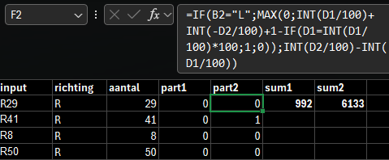
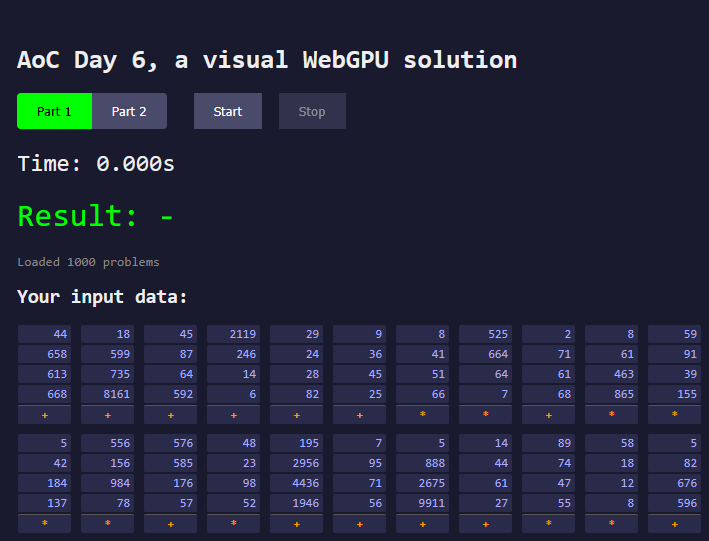
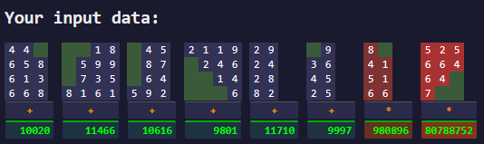
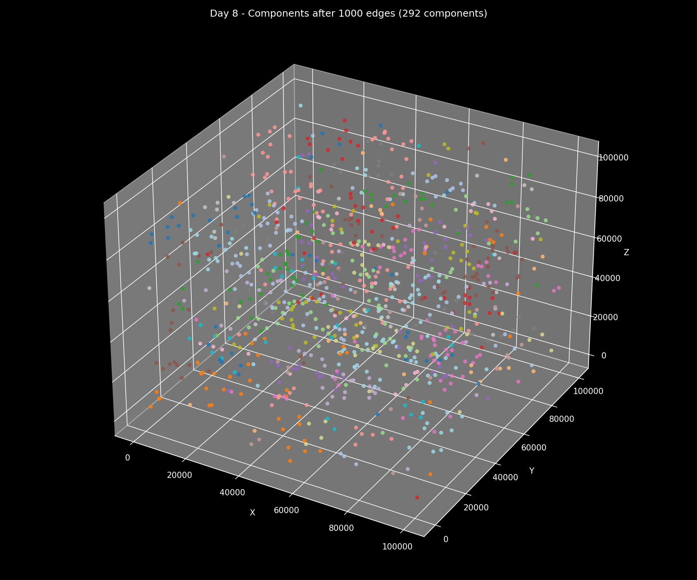
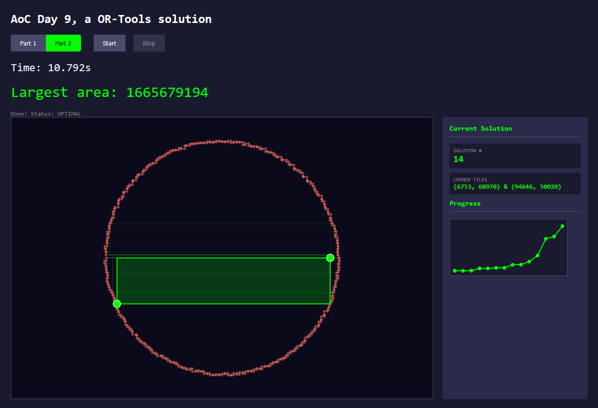

# Advent of Code 2025

A different tool (software, language or library) for each day.

---

## Bingo Card

12 days, 12 options, pick wisely.

|      |      |      |
|:----:|:----:|:----:|
| ~~Bash~~ | ~~CUDA~~ | ~~Excel~~ |
| ~~Julia~~ | Marimo | ~~MATLAB~~ |
| ~~NetworkX~~ | OpenVINO | ~~OR-Tools~~ |
| ~~Rust~~ | ~~SQL~~ | ~~WebGPU~~ |

---
## Picks 

<strong>Why did I pick these tools?</strong>

- **Bash:** used bash a lot the last years and want to try some parsing with it.
- **CUDA(Python):** new for me, brute forced day 11 last year (blinking intensifies) using CuPy and actually had a lot of fun, want to try and write my own kernel for a problem that is more fitting this time around.
- **Excel:** used to use Excel a lot until 7-8 years ago, will use pure formulas, no macros.
- **Julia:** also new for me, but heard a lot of great things about it.
- **Marimo(Python):** definitely a flex pick, replaced all my EDA notebooks and light UI with Marimo, goal is to use the interactive nature of Marimo for a problem that is suited for it (like day 8 '22).
- **MATLAB:** used this 15 years ago for the last time, liked it then.
- **NetworkX(Python):** went deep into networkx last year and really enjoyed getting back into graph algorithms.
- **OpenVINO(Python):** want to do one edge-inference style solution with an old Intel Neural Compute Stick 2, will probably regret this pick.
- **OR-Tools(Python):** it's often not ideal, but I want to solve using solvers at least once.
- **Rust:** have been learning Rust for the last year and a half, still struggling a bit though.
- **SQL:** SQL can JOIN this year too.
- **WebGPU(TypeScript):** another new one, want to manage the puzzle state from the browser and offload heavy lifting to the GPU. Decided on Typescript instead of wgpu-py because I want to have a browser run demo/visualization. 

---
## Log
| Day | Tool | Rationale/Experience | Rating | Minutes |
|-----|------|-----------|------------|---------|
| [1](day01/) | Excel | Good problem to tick off excel reused most for part 2. | Easy  | 13/15    |
| [2](day02/) | Bash | Used Termux on android, part 1 was straightforward, got stuck a bit on part 2, mainly because long processing time complicated it.  |   Easy    |  19/54    |
| [3](day03/) | SQL| Should have been easy, and part 1 was ok, but didn't translate to at all to part 2, so wasted a lot of time, even tried batching adapted part 1 script before using subqueries. | Medium |  33/96 |
| [4](day04/) | MATLAB | Besides the weird syntax and not so great documentation this was very straightforward. | Easy | 32/52 |
| [5](day05/) | Julia | Fun fact! Arrays start at 1 in Julia, part 1 took a bit longer because reading is hard and I was calculating the spoiled ID's instead, reused part 1 for part 2. | Easy |  41/52 |
| [6](day06/) | WebGPU | That was challenging (but fun!), ran into issues for part two because I used a float32 so the calculation was actually correct, but the result not. Very happy with the end result, spend way too much time on styling. | Medium | 134/208 |
| [7](day07/) | Rust | I may have been less rusty (or more) than I thought, initially wanted to go with a hashmap, but instead went with a simple set/vector solution for both 1 & 2. | Medium | 25/38 |
| [8](day0/)   | NetworkX   | Happy with my networkx pick, used unionfind(kruskals) for both part 1 & 2, stop at 1000 edges for 1 and when connected for 2. | Easy | 12/19 |
| [9](day09/)   | OR-Tools | Part 1 was ok, would have been a lot easier with itertools instead of ortools. Feeding the solver the right constraints for part 2 was a challenge. Used the CP-SAT Solver and the python documentation is excellent. | Hard | 39/68 |
| [10](day10/)  | CUDA | Ofcourse the perfect solver problem comes the day after shoehorning my solver pick. Brute force it is GPU will go brrrr. |            |         |
| [11](day11/)  | ?    |           |            |         |
| [12](day12/)  | ?    |           |            |         |

## Highlights (contains spoilers!)

### Day 1 - Excel

> Not so elegant but simple formula for part 2.

### Day 3 - SQL

> Sub 200 ms for part 2 (was taking over 30 minutes with the adapted part 1 query).

### Day 6 - WebGPU

> Fully in Advent of Code styling!

### Day 8 - NetworkX

> Obligatory 3D plot of part 1.

### Day 9 - OR-Tools

> I know the OR-Tools pick is not ideal, but sometimes you have to find a problem for your solution instead of a solution for your problem.

---
