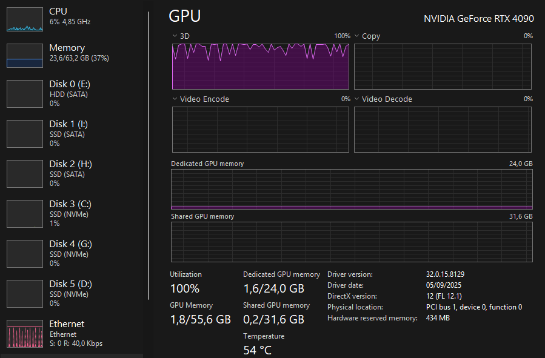
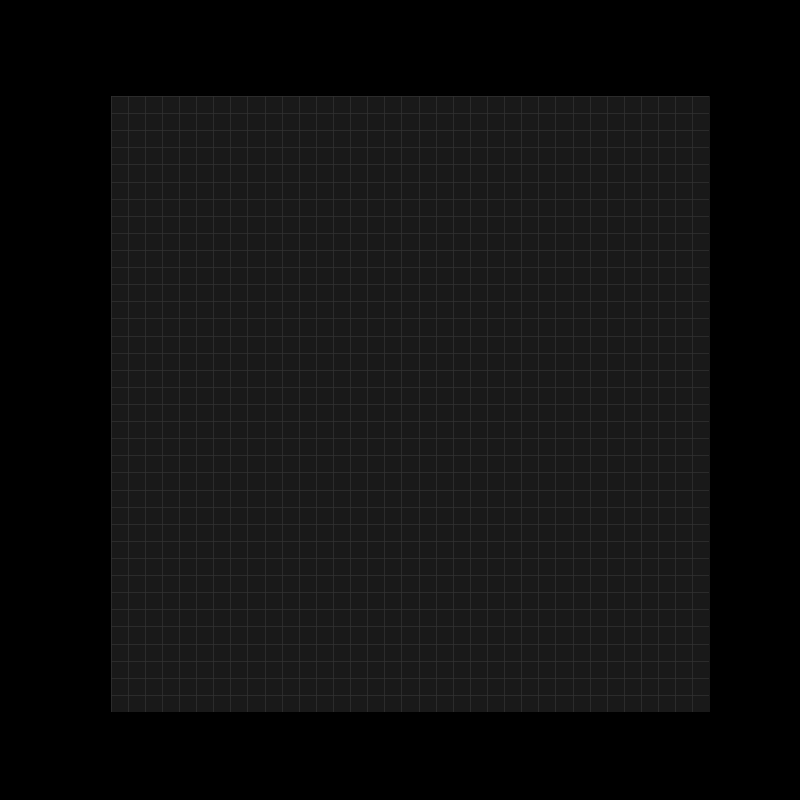
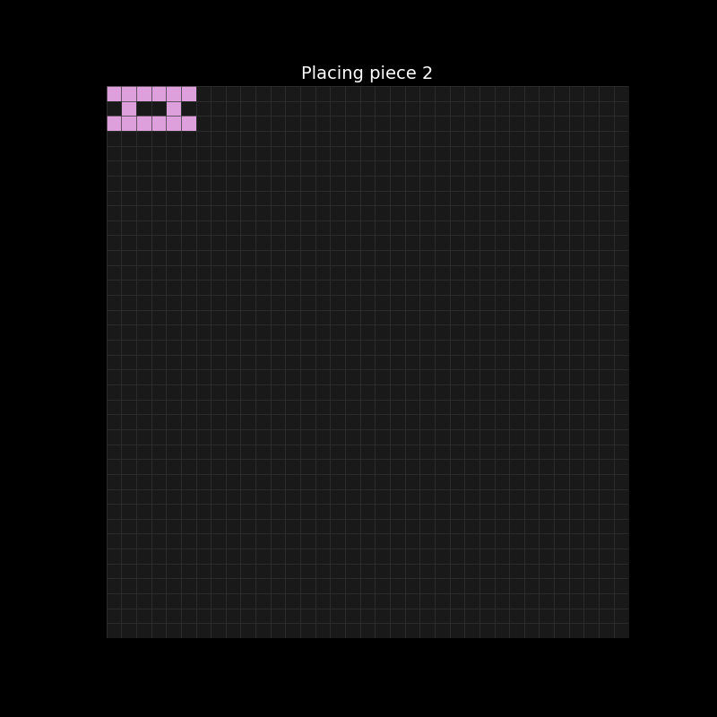

# Advent of Code 2025

A different tool (software, language or library) for each day.

## Bingo Card

12 days, 12 options, pick wisely.

|      |      |      |
|----|----|----|
| ~~Bash~~ | ~~CUDA~~ | ~~Excel~~ |
| ~~Julia~~ | ~~Marimo~~ | ~~MATLAB~~ |
| ~~NetworkX~~ | ~~OpenVINO~~ | ~~OR-Tools~~ |
| ~~Rust~~ | ~~SQL~~ | ~~WebGPU~~ |

---

### Rules

- Pick a new pick each day, and once picked, it cannot be used again.
- Once a pick is locked in, it cannot be changed anymore, even if part 2 doesn't suit the pick.
- No AI autocomplete allowed, with the exception of generating HTML.
- Maximize learning and fun, speed is not relevant.

---

### Languages used


## Log

| Day | Tool | Rationale/Experience | Rating | Minutes |
|-----|------|-----------|------------|---------|
| [1](day01/) | Excel | Good problem to tick off excel reused most for part 2. | Easy  | 13/15    |
| [2](day02/) | Bash | Used Termux on android, part 1 was straightforward, got stuck a bit on part 2, mainly because long processing time complicated it.  |   Easy    |  19/54    |
| [3](day03/) | SQL| Should have been easy, and part 1 was ok, but didn't translate to at all to part 2, so wasted a lot of time, even tried batching adapted part 1 script before using subqueries. | Medium |  33/96 |
| [4](day04/) | MATLAB | Besides the weird syntax and not so great documentation this was very straightforward. | Easy | 32/52 |
| [5](day05/) | Julia | Fun fact! Arrays start at 1 in Julia, part 1 took a bit longer because reading is hard and I was calculating the spoiled ID's instead, reused part 1 for part 2. | Easy |  41/52 |
| [6](day06/) | WebGPU | That was challenging (but fun!), ran into issues for part two because I used a float32 so the calculation was actually correct, but the result not. Very happy with the end result, spend way too much time on styling. | Medium | 134/208 |
| [7](day07/) | Rust | I may have been less rusty (or more) than I thought, initially wanted to go with a hashmap, but instead went with a simple set/vector solution for both 1 & 2. | Medium | 25/38 |
| [8](day08/)   | NetworkX   | Happy with my networkx pick, used unionfind(kruskals) for both part 1 & 2, stop at 1000 edges for 1 and when connected for 2. | Easy | 12/19 |
| [9](day09/)   | OR-Tools | Part 1 was ok, would have been a lot easier with itertools instead of ortools. Feeding the solver the right constraints for part 2 was a challenge. Used the CP-SAT Solver and the documentation was very helpful. | Hard | 39/68 |
| [10](day10/)  | CUDA | Ofcourse the perfect solver problem comes the day after shoehorning my solver pick. Bruteforced part 1, GPU didn't even sweat, the challenge was reading comprehension. Part 2 was not bruteforcable so I tried different ways of reducing the search space before feeding it to the GPU, tried DFS, getting close with a genetic algo on CUDA before bruteforcing the space around the results from the algo, but in the end a pure GPU solution with a matrix row reduction step in the kernel worked. | Extreme | 135/>6h |
| [11](day11/)  | Marimo | Played around with altair, was hoping for a bit more interactivity opportunities in part 2. | Easy | 37/54  |
| [12](day12/)  | OpenVINO | Used convolutions to detect valid piece placements, treating shapes as kernels and the board as a tensor, effectively abusing computer vision for a constraint satisfaction problem. Had to really rephrame the problem to fit OpenVINO in the solution. | Hard| 110 |

---

## Picks

<details>
<summary><strong>Why did I pick these tools?</strong></summary>

- **Bash:** used bash a lot the last years and want to try some parsing with it.

- **CUDA(Python):** new for me, brute forced day 11 last year (blinking intensifies) using CuPy and actually had a lot of fun, want to try and write my own kernel for a problem that is more fitting this time around.

- **Excel:** used to use Excel a lot until 7-8 years ago, will use pure formulas, no macros.

- **Julia:** also new for me, but heard a lot of great things about it.

- **Marimo(Python):** definitely a flex pick, replaced all my EDA notebooks and light UI with Marimo, goal is to use the interactive nature of Marimo for a problem that is suited for it (like day 8 '22).

- **MATLAB:** used this 15 years ago for the last time, liked it then.

- **NetworkX(Python):** went deep into networkx last year and really enjoyed getting back into graph algorithms.

- **OpenVINO(Python):** want to do one edge-inference style solution with an old Intel Neural Compute Stick 2, will probably regret this pick.

- **OR-Tools(Python):** it's often not ideal, but I want to solve using solvers at least once.

- **Rust:** have been learning Rust for the last year and a half, still struggling a bit though.

- **SQL:** SQL can JOIN this year too.

- **WebGPU(TypeScript):** another new one, want to manage the puzzle state from the browser and offload heavy lifting to the GPU. Decided on Typescript instead of wgpu-py because I want to have a browser run demo/visualization.

</details>

## Highlights

<details>

<summary><strong>(contains spoilers!)</strong></summary>

### Day 1 - Excel


> Not so elegant but simple formula for part 2.

### Day 3 - SQL


> Sub 200 ms for part 2 (was taking over 30 minutes with the adapted part 1 query).

### Day 6 - WebGPU


> Fully in Advent of Code styling!

### Day 8 - NetworkX


> Obligatory 3D plot of part 1.

### Day 9 - OR-Tools


> I know the OR-Tools pick is not ideal, but sometimes you have to find a problem for your solution instead of a solution for your problem. (aged like milk)

### Day 10 - CUDA



> GPU goes BRRRRR

### Day 12 - OpenVINO

<p align="center">


</p>

> Convolutions, not just for detecting cats anymore.

</details>

## Quickstart

<details>
<summary><strong>How to run the solutions yourself</strong></summary>

### Requirements
- Python 3.13+
- [uv](https://docs.astral.sh/uv/) for dependency management
- CUDA 12.x (for Day 10 only)

### Setup
```bash
git clone https://github.com/stevenbtw/aoc_2025.git
cd aoc_2025
uv sync
```

### Run a solution
```bash
uv run python day03/solution.py
uv run python day10/part1.py
uv run python day10/part2.py
uv run marimo edit day11/notebook.py
uv run python day12/run_inference.py input.txt
```

### Non-Python days
| Day | How to run |
|-----|------------|
| 1 | Open `day01/solution.xlsx` in Excel |
| 2 | `bash day02/solution.sh` |
| 4 | Open `day04/solution.m` in MATLAB |
| 5 | `julia day05/solution.jl` |
| 6 | See [day06/README.md](day06/README.md) (requires Node.js + WebGPU browser) |
| 7 | `cargo run` in `day07/` |

</details>

## Retrospective

### Clocked in a little over 19 hours in total, but finished all 12 days with the constraint intact!

**Here are some of my takeaways:**

**What worked:** The forced Bingo Card challenge meant I actually touched things I'd been meaning to pick up (again) for years. The "no changing picks for Part Twooneone" rule created a really intense learning experience. Day 10 with CUDA would have been much easier with something else, but pushing through taught me more than changing would have. Trying weird solutions while listening to a notebooklm podcast of the cuda programming guide will be one of the nice memories of Advent of Code this year. Having only 12 days for this challenge was good, 25 days was pretty taxing already using the go-to python solutions last year, I cannot imagine doing this for another 13 days.

**Hard things:** Troubleshooting the precision error with WebGPU, the matrix row reduction approach for Day 10, and rethinking OpenVINO convolutions for constraint satisfaction. All of these brought back real problem solving fun, out-of-the-box thinking and not just identifying the correct python package. Another hard thing was to not bloat this readme with too many jokes, yes, this is me constraining myself.

**Easy things:** A lot of the CUDA, WebGPU, and OpenVINO code is copied straight from the documentation with my logic hacked into it. Some solutions probably look more polished than my actual knowledge of these tools. I also didn't want to use generative AI for the entire period, it's very refreshing (and humbling) to turn everthing off and relearn how to code for two weeks. But when I couldn't be bothered with writing HTML I only wrote comments and pressed tab for everything (both day 6 and 9). And I did use chatGPT and notebooklm to help me learn new concepts which made things easier for sure. 

**For next time:** Probably only Python & Rust, and try different techniques/packages, maybe use Marimo notebooks starting with some EDA each day, check the [lazy solution](day12/lazysolution/solution.py) why this can be helpful.
